## Solo Violin Recording - Bach Loure (BWV 1006:II)

### Recording Session Information
The recording session was 1 hour long, including setup/down, with the recording running for 38.24. Noa David, the performer played Bach’s *Violin Partita no. 3 in E major BWV 1006:II.* *Loure.* The session was recorded and edited in [REAPER](https://www.reaper.fm/).

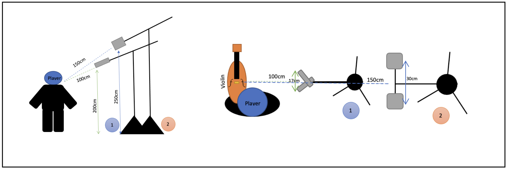
Since it was a fairly simple setup and I had extra equipment and channels available I decided to setup two pairs of mics (which was overkill).
I setup an XY (1) and an AB (2) pair at 1-1.5m away from the performer, but in the end I decided to not use the AB pair, as the XY pair provided the sound quality I required, and the AB pair didn’t add anything further to the mix. I had them positioned above the player, facing down towards the bridge of the violin. I also instructed the performer to avoid moving too much, as this can change the sound of a take in a narrow pickup pattern, making comping harder.

### Microphones
The microphones used were setup as follows:
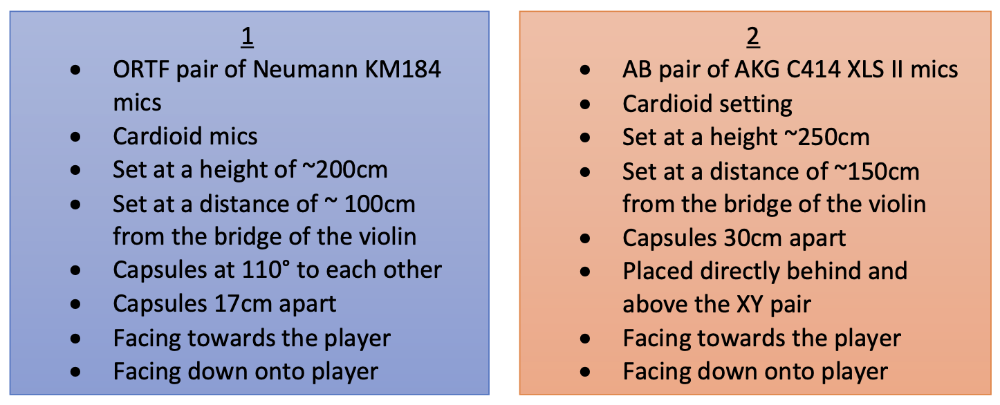

The [Neuman KM184](https://www.neumann.com/en-gb/products/microphones/km-184-series-180/) is ideal for XY or ORTF setups because of its small footprint and the ease of aligning its capsule in a pair. They are however, quite pricey.

The [AKG C414 XLS II](https://www.akg.com/microphones/condenser-microphones/C414XLS.html) is also very pricey, but somewhat more versatile because of its alterable pickup pattern, allowing it to be used to many different setups. The capsules are quite hard to align due to the shape of the protective mesh, and its footprint is larger than the Neuman.

The finished comp edits were in the following locations:

<!-- FM:Snippet:Start data:{"id":"Invisible heading","fields":[]} -->

### Edit Locations

<!-- FM:Snippet:End -->


  

| Edit # | Location in Score | Start Time (Wav) | Start Time (Source) | Notes                    |
|--------|------------------|------------------|---------------------|--------------------------|
| 0      | Up beat          | 0:00.000         | 6:17.644            | Beginning of piece       |
| 1      | Bar 1.1          | 0:01.839         | 3:19.895            |                          |
| 2      | Bar 1.3          | 0:03.555         | 11:56.139           |                          |
| 3      | Bar 1.5.2        | 0:06.049         | 6:23.644            |                          |
| 4      | Bar 2.2.2        | 0:08.626         | 12:01.510           |                          |
| 5      | Bar 2.6          | 0:11.652         | 6:29.008            |                          |
| 6      | Bar 3.1          | 0:12.830         | 13:20.307           |                          |
| 7      | Bar 3.2.2        | 0:14.260         | 3:32.906            |                          |
| 8      | Bar 4.6          | 0:22.852         | 12:54.404           |                          |
| 9      | Bar 5.2.2        | 0:25.500         | 14:27.021           |                          |
| 10     | Bar 6.6          | 0:33.632         | 3:51.500            |                          |
| 11     | Bar 7.1          | 0:34.431         | 15:48.102           |                          |
| 12     | Bar 7.4          | 0:36.949         | 14:38.506           |                          |
| 13     | Bar 7.6          | 0:38.531         | 33:54.063           |                          |
| 14     | Bar 8.2          | 0:40.267         | 16:48.438           | Take +2.10db             |
| 15     | Bar 8.3          | 0:41.136         | 6:56.108            | Take -2.10db             |
| 16     | Bar 8.5          | 0:42.784         | 16:51.164           |                          |
| 17     | Bar 9.4          | 0:47.156         | 7:01.526            |                          |
| 18     | Bar 10.3         | 0:51.520         | 18:10.111           |                          |
| 19     | Bar 10.5.4       | 0:54.209         | 18:40.052           | Take -1.6db              |
| 20     | Bar 11.3         | 0:56.919         | 7:10.835            |                          |
|        | **Repeat 1**     |                  |                     |                          |
| 21     | Up beat          | 1:00.030         | 11:52.398           |                          |
| 22     | Bar 1.1          | 1:01.900         | 3:19.901            | Reused take              |
| 23     | Bar 1.3          | 1:03.511         | 7:17.128            | Take -3.6db              |
| 24     | Bar 2.1          | 1:07.259         | 6:24.965            | Take -3.6db, Reused take |
| 25     | Bar 2.2.2        | 1:08.493         | 12:40.088           |                          |
| 26     | Bar 2.4          | 1:15.347         | 6:32.643            |                          |
| 27     | Bar 3.4          | 1:16.562         | 12:48.242           |                          |
| 28     | Bar 3.5.2        | 1:23.632         | 6:40.374            |                          |
| 29     | Bar 5.1          | 1:26.018         | 14:28.352           |                          |
| 30     | Bar 5.4          | 1:30.034         | 3:48.764            | Take -0.6db              |
| 31     | Bar 6.2.4        | 1:32.526         | 14:34.912           |                          |
| 32     | Bar 7.1          | 1:33.654         | 16:42.560           |                          |
| 33     | Bar 7.6          | 1:37.643         | 17:18.408           | Take -1db                |
| 34     | Bar 8.2          | 1:39.681         | 16:17.761           | Take -1.4db              |
| 35     | Bar 8.6          | 1:43.209         | 16:52.060           |                          |
| 36     | Bar 9.3          | 1:45.843         | 16:23.878           |                          |
| 37     | Bar 9.4          | 1:46.543         | 18:04.943           |                          |
| 38     | Bar 10.5         | 1:53.990         | 18:39.591           |                          |
| 39     | Bar 11.3         | 1:57.200         | 7:10.900            |                          |
| 40     | Bar 11.4         | 1:58.061         | 18:16.714           |                          |
|        | **B section (after Repeat 1)** | | | |
| 41     | Bar 11.5.2       | 2:00.257         | 4:17.884            |                          |
| 42     | Bar 12.2.2       | 2:03.299         | 20:42.775           |                          |
| 43     | Bar 12.4         | 2:04.704         | 8:13.790            |                          |
| 44     | Bar 12.6         | 2:06.794         | 4:24.193            |                          |
| 45     | Bar 13.1         | 2:07.672         | 20:47.170           |                          |
| 46     | Bar 13.2.2       | 2:10.293         | 4:27.303            |                          |
| 47     | Bar 13.5         | 2:11.553         | 8:19.897            |                          |
| 48     | Bar 14.4         | 2:17.073         | 9:43.641            | Take -0.4db              |
| 49     | Bar 14.5         | 2:18.274         | 22:06.620           | Take +4.6db              |
| 50     | Bar 15.4         | 2:23.203         | 21:39.690           |                          |
| 51     | Bar 16.3         | 2:28.565         | 24:16.492           |                          |
| 52     | Bar 17.3         | 2:34.321         | 35:42.946           |                          |
| 53     | Bar 18.4         | 2:41.518         | 24:30.020           |                          |
| 54     | Bar 18.5.2       | 2:44.040         | 8:50.353            |                          |
| 55     | Bar 19.1         | 2:45.330         | 5:02.023            |                          |
| 56     | Bar 19.4         | 2:47.590         | 31:45.253           |                          |
| 57     | Bar 20.4         | 2:53.106         | 31:25.082           |                          |
| 58     | Bar 20.5.2       | 2:55.405         | 31:53.285           |                          |
| 59     | Bar 21.4         | 3:01.181         | 5:17.285            |                          |
| 60     | Bar 21.6         | 3:03.136         | 32:01.122           |                          |
| 61     | Bar 22.3         | 3:05.860         | 27:20.315           |                          |
| 62     | Bar 23.5         | 3:14.808         | 32:12.810           |                          |
| 63     | Bar 24.1         | 3:17.008         | 27:31.595           |                          |
|        | **B section (Repeat 2)** | | | |
| 64     | Bar 11.5.2       | 3:24.689         | 9:27.674            |                          |
| 65     | Bar 12.1         | 3:26.475         | 20:41.561           | Reused take              |
| 66     | Bar 12.5.2       | 3:31.199         | 4:24.202            |                          |
| 67     | Bar 12.6         | 3:32.021         | 20:47.170           | Reused take              |
| 68     | Bar 13.3         | 3:35.112         | 20:11.369           |                          |
| 69     | Bar 13.4         | 3:36.037         | 8:19.925            | Reused take              |
| 70     | Bar 14.3         | 3:40.478         | 9:42.508            | Reused take              |
| 71     | Bar 14.5         | 3:42.829         | 21:35.115           |                          |
| 72     | Bar 15.4         | 3:47.396         | 36:17.364           |                          |
| 73     | Bar 16.4         | 3:54.399         | 23:21.787           |                          |
| 74     | Bar 17.1         | 3:57.372         | 24:20.396           |                          |
| 75     | Bar 17.2.4       | 3:59.258         | 35:42.741           |                          |
| 76     | Bar 18.4         | 4:06.445         | 24:30.020           | Reused take              |
| 77     | Bar 18.5.2       | 4:09.046         | 23:35.653           |                          |
| 78     | Bar 19.4         | 4:12.944         | 31:45.270           | Reused take              |
| 79     | Bar 20.4         | 4:18.437         | 31:25.080           | Reused take              |
| 80     | Bar 20.5.2       | 4:20.768         | 33:07.711           |                          |
| 81     | Bar 22.1         | 4:28.349         | 32:01.109           |                          |
| 82     | Bar 22.3         | 4:31.164         | 27:20.332           |                          |
| 83     | Bar 23.5         | 4:40.119         | 28:45.842           |                          |
| 84     | Bar 24.4         | 4:46.213         | 27:35.786           | End of piece             |

  
  

Here is a copy of the score, highlighted with the edit points for the comp:
<!-- FM:Snippet:Start data:{"id":"Invisible heading","fields":[]} -->

### Annotated score

<!-- FM:Snippet:End -->


	





	


<!-- FM:Snippet:Start data:{"id":"Invisible heading","fields":[]} -->

Despite our best attempts, and multiple takes being recorded, there were unfortunately some issues that couldn't be resolved in the recording session. These mostly had to do with instrument noises, and loud breathing, which would have been lessened by setting the mics up a bit further away.

A lot of comping had to be done to fix poor intonation, or squeaks from the instrument, which would not have been necessary if the performer had longer notice to prepare for the session. This just serves as a reminder that preparing beforehand saves a lot of work afterwards.

### Issues that couldn’t be resolved

<!-- FM:Snippet:End -->



These issues couldn’t be resolved, either because there were no good takes of the section, or because there were no good edit points near the issue.

| Issue # | Location in Audio | Issue                         |
|---------|------------------|-------------------------------|
| 1       | 1.2.13           | Loud breath                   |
| 2       | 2.3.37           | Loud breath                   |
| 3       | 4.1.80           | Tuning issue                  |
| 4       | 4.4.40           | Wobbly note                   |
| 5       | 5.2.77           | Audible shift                 |
| 6       | 7.3.93           | Harsh note                    |
| 7       | 8.1.92           | Loud breath                   |
| 8       | 8.4.34           | Harsh note                    |
| 9       | 10.2.19          | Harsh note                    |
| 10      | 11.2.77          | Loud breath                   |
| 11      | 12.2.53          | Loud breath                   |
| 12      | 12.4.81          | Loud breath                   |
| 13      | 13.4.98          | Tuning issue                  |
| 14      | 14.3.17          | Harsh note                    |
| 15      | 17.1.46          | Harsh note and tuning issue   |
| 16      | 17.4.23          | Tuning issue                  |
| 17      | 18.2.77          | Slight tuning issue           |
| 18      | 19.1.34          | Tuning issue                  |
| 19      | 19.3.37          | Harsh note                    |
| 20      | 20.4.16          | Slight tuning issue           |
| 21      | 21.1.84          | Tuning issue                  |
| 22      | 21.3.36          | Tuning issue                  |
| 23      | 24.1.80          | Harsh/broken note             |
| 24      | 25.2.42          | Fingerboard noise             |
| 25      | 28.1.41          | Fingerboard noise             |
| 26      | 29.2.84          | Loud breath                   |
| 27      | 29.4.70          | Loud breath and wobbly note   |
| 28      | 31.1.84          | Loud breath                   |
| 29      | 31.4.46          | Loud breath                   |
| 30      | 33.4.65          | Loud breath                   |
| 31      | 35.2.14          | Audible shift                 |
| 32      | 37.1.88          | Loud breath                   |
| 33      | 37.3.28          | Harsh note                    |
| 34      | 38.1.73          | Harsh note/tuning issue       |
| 35      | 38.4.49          | Harsh note                    |
| 36      | 39.3.51          | Split note                    |
| 37      | 40.1.64          | Harsh note                    |
| 38      | 41.1.34          | Loud breath                   |
| 39      | 41.3.83          | Loud breath                   |
| 40      | 42.2.17          | Loud breath                   |
| 41      | 44.1.53          | Harsh note                    |
| 42      | 46.3.41          | Harsh/wobbly note             |
| 43      | 47.3.96          | Loud breath                   |
| 44      | 48.4.45          | Loud breath                   |
| 45      | 50.2.42          | Slight tuning issue           |
| 46      | 50.4.15          | Tuning issue                  |
| 47      | 51.3.51          | Tuning issue                  |
| 48      | 52.2.79          | Audible shift                 |
| 49      | 53.1.20          | Fingerboard noise             |
| 50      | 54.2.87          | Harsh/split note              |
| 51      | 55.1.91          | Loud breath                   |
| 52      | 56.1.63          | Loud breath                   |
| 53      | 58.1.60          | Audible shift                 |
| 54      | 59.4.82          | Loud breath/harsh note        |
| 55      | 61.2.07          | Loud breath                   |
| 56      | 61.3.76          | Wobbly note                   |
| 57      | 62.4.41          | Tuning issue                  |
| 58      | 63.2.12          | Harsh note/tuning issue       |
| 59      | 65.2.31          | Tuning issue                  |
| 60      | 67.4.97          | Loud breath                   |
| 61      | 69.3.86          | Tuning issue                  |
| 62      | 70.3.12          | Loud breath                   |
| 63      | 70.4.38          | Split note                    |
| 64      | 72.4.14          | Tuning issue                  |
| 65      | 73.3.53          | Loud breath                   |
| 66      | 74.2.45          | Loud breath                   |
| 67      | 77.1.80          | Harsh note                    |
| 68      | 78.1.74          | Tuning issue                  |
| 69      | 80.1.95          | Loud breath                   |
| 70      | 80.3.74          | Tuning issue                  |
| 71      | 83.2.62          | Loud breath                   |
| 72      | 84.3.46          | Loud breath                   |
| 73      | 85.4.79          | Loud breath                   |
| 74      | 87.3.20          | Tuning issue                  |
| 75      | 88.3.85          | Loud breath                   |
| 76      | 91.3.09          | Loud breath                   |
| 77      | 93.1.16          | Loud breath                   |
| 78      | 97.3.86          | Loud breath                   |
| 79      | 99.2.53          | Loud breath                   |
| 80      | 99.4.24          | Tuning issue/harsh note       |
| 81      | 101.3.02         | Loud breath                   |
| 82      | 103.2.42         | Loud breath                   |
| 83      | 105.1.28         | Tuning issue/wobbly note      |
| 84      | 107.3.73         | Tuning issue                  |
| 85      | 108.4.97         | Harsh note                    |
| 86      | 110.2.03         | Loud breath                   |
| 87      | 111.3.76         | Loud breath                   |
| 88      | 111.4.96         | Tuning issue                  |
| 89      | 112.4.15         | Loud breath                   |
| 90      | 115.3.68         | Loud breath                   |
| 91      | 116.3.67         | Loud breath                   |
| 92      | 117.3.30         | Loud breath                   |
| 93      | 117.4.28         | Tuning issue                  |
| 94      | 118.2.47         | Harsh note                    |
| 95      | 119.1.76         | Harsh note                    |
| 96      | 119.3.60         | Tuning issue                  |
| 97      | 120.3.58         | Tuning issue                  |
| 98      | 122.3.42         | Loud breath                   |
| 99      | 127.2.09         | Loud breath                   |
| 100     | 127.3.19         | Harsh note                    |
| 101     | 128.3.62         | Loud breath                   |
| 102     | 130.1.75         | Tuning issue                  |
| 103     | 135.3.60         | Loud breath                   |
| 104     | 140.2.23         | Loud breath                   |
| 105     | 142.1.15         | Loud breath                   |
| 106     | 143.4.87         | Loud breath                   |

 



### Further editing information

I worked with two REAPER sessions, one for my source recording, which included all my microphone tracks, and all my mixing edits. I then imported this into a second, Edit session as a sub-project, and worked on my comping edits, and reverb in this session. This method allowed me to edit my source recording mix independently from my comping edits, leaving a single stereo track to work with in the Edit session.

### The mix session
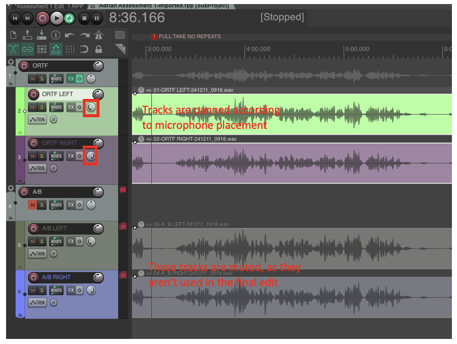

An EQ has been applied to the ORTF. I applied a *High pass* filter to remove the unnecessary low frequencies around **200HZ**, and a *Low pass* to roll off the high end slightly around **20kHZ**, to reduce the harshness of the source recording.

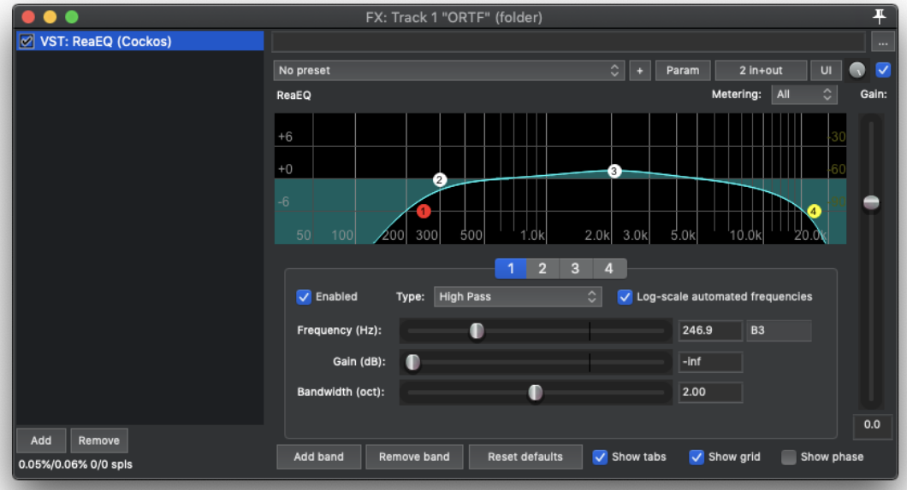

I decided the levels were good with the one pair of microphones, so didn’t change the faders, leaving them at default. With the A/B I found too much of Noa’s breath sound was picked up, alongside too much room sound, which was undesirable as I added atmosphere in post via an artificial reverb, rendering the room sound irrelevant.

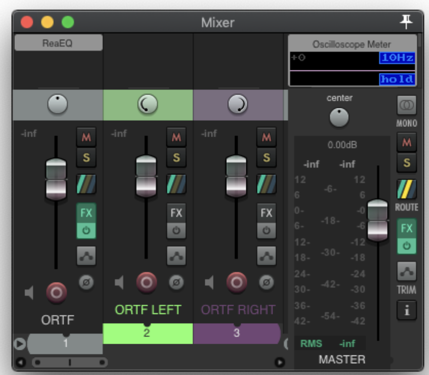

### The edit session
In my editing process I liberally used markers to decide where to put edit points and mark out issues that needed resolving. In my edit session I applied a unique colour to all the different takes, so that it was easy to tell where edits were and which takes I used. 

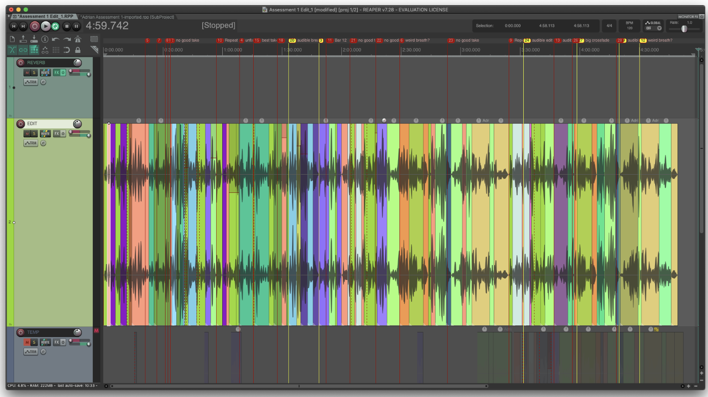

This session is also where I did the majority of my post processing work, applying an artificial reverb to the source sound, as the recording studio had a naturally dry room sound, and my goal was to make the performance sound like it took place in a concert hall.

I used 4 main tracks, a REVERB track, which contained the artificial reverb, an EDIT track, which contained the final edit of the source recording, a TEMP track where I would temporarily drag my takes for editing, and then a TAKES folder, which contained all of my various takes for different parts of the piece, lined up with where they happen.

On the REVERB track I used an FX chain of two EQs, and an impulse response based artificial reverb.
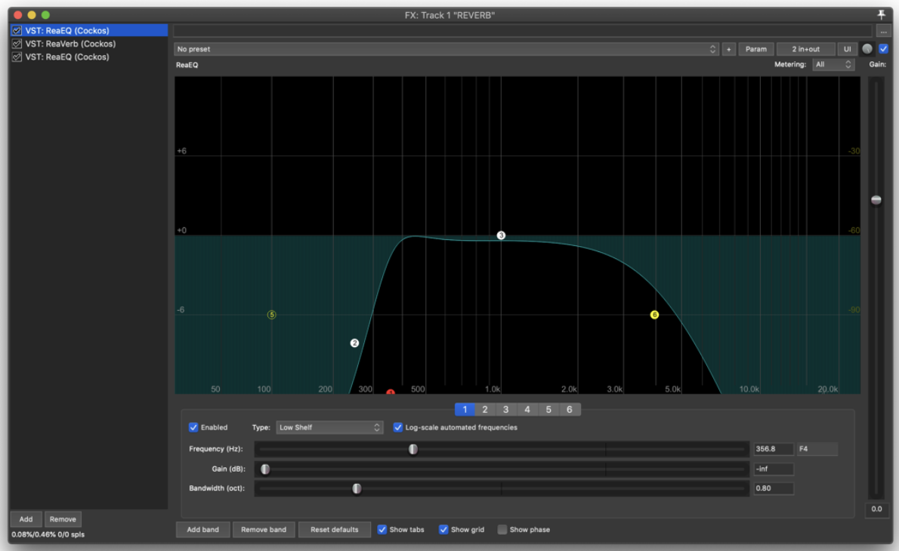

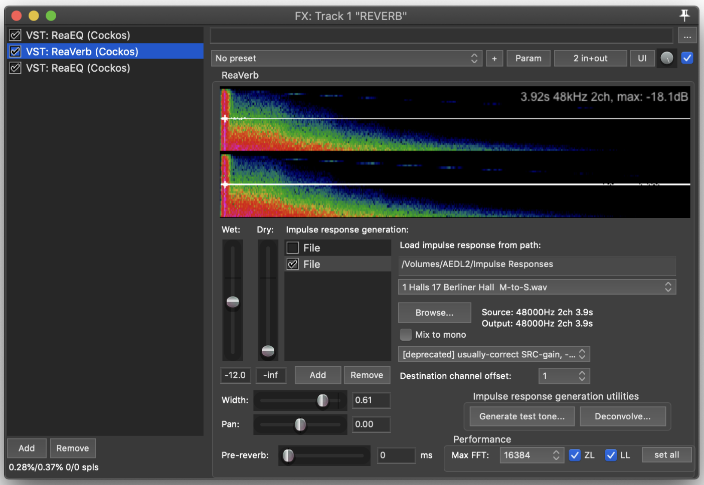

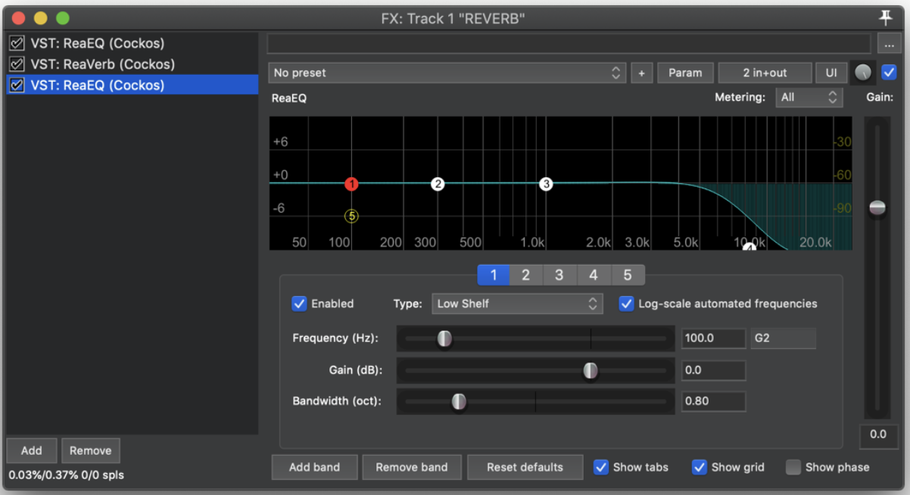

During the recording process I inserted a marker at every new take, which made splitting the source recording into the various takes easier in the Edit session. 
I began with two full takes of the piece, which formed **takes 1 and 2**. I then split the piece up into various sections, and worked through them chronologically with Noa, aiming for at least two takes of each section (some problematic sections had considerably more takes). 
I then lined up all the takes under their respective sections in the full take, which made auditioning different takes much easier.

I named each take track according to the bar number it represented, and a tag (e.g. **T1**) indicating which take number it was. I also made sure, as mentioned earlier, that all my takes had a different colour to make identifying them easier.

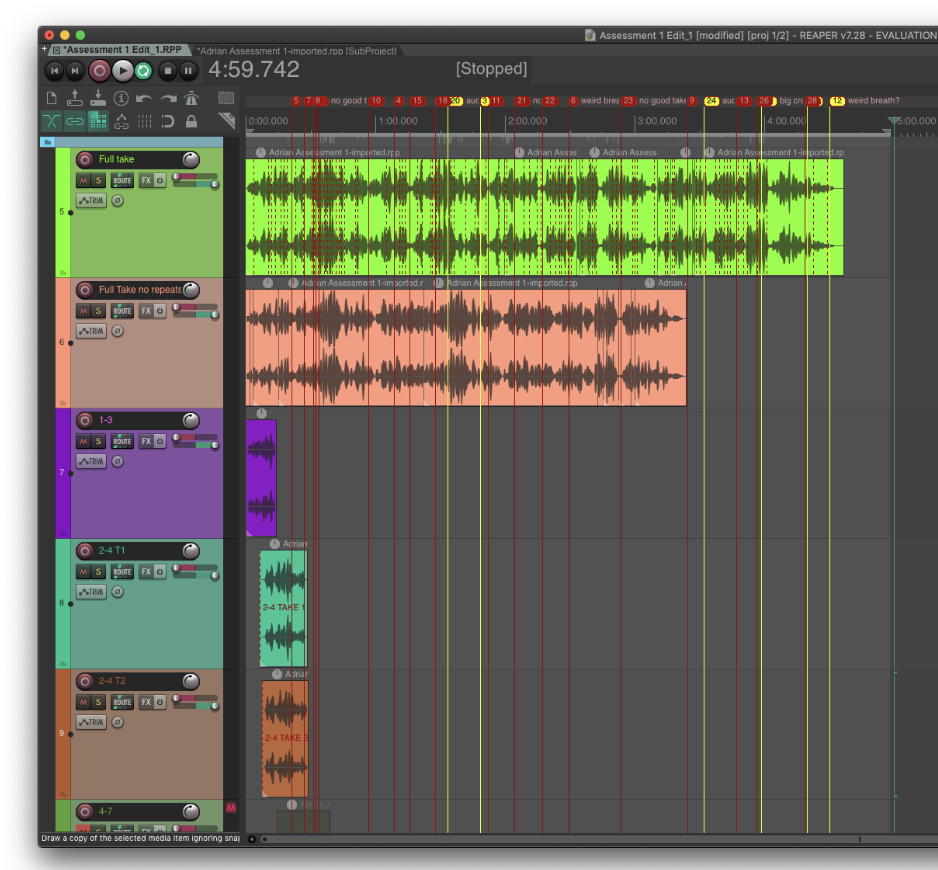

I worked with a full take, splicing in alternative takes as necessary to correct mistakes in the performance. A big challenge I faced was the amount of breath noise that was picked up in the recording, which made a lot of normally good edit points such as rests difficult to splice into without cutting the breath short.

In my editing process I would extend the audio past the point at which I wanted to cut and overlap my takes. I would then adjust the crossfade region to happen exactly at the desired cut point, just before or after a note as sounded to mask the transition. The volume of some of takes was increased so as to be uniform, as Noa moved slightly over the course of the session, rendering some takes slightly louder than others.

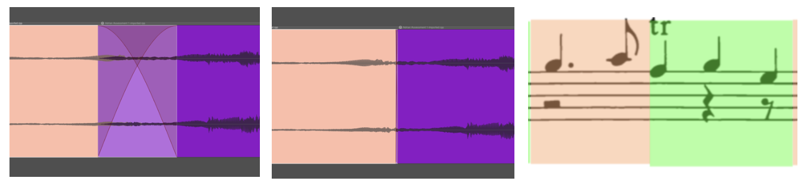

I made sure to begin and end the track in silence, fading the beginning and end takes slightly as well, to avoid any pops/clicks from background noise. I rendered the file slightly longer than the audio region, to avoid cutting the reverb tail short.

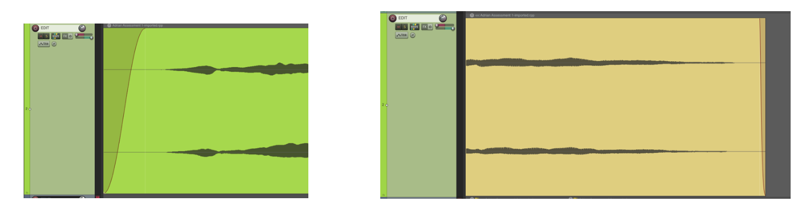

### Rendering
I rendered the final piece via the *master mix*, as a **WAV**at **48000** sample rate with **24 bit** bit depth. I made sure to mute the TEMP track, and all of the take tracks, only rendering my EDIT and REVERB tracks. I set my bounds as **Time selection**, making sure to leave a tail at the end of my selection to allow the reverb to decay without being cut off.
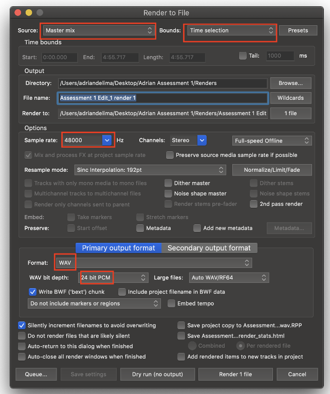

