Anyone who's used [Sibelius](https://www.avid.com/sibelius) before has been through the pain of listening to the General Midi sound set. It's frankly embarassing how bad it still is in 2026.

Fortunately Sibelius comes with some options to remedy this. You can install the Sibelius Sounds pack (Previously Sibelius 7 Sounds) if you have a legitimate copy of the software (don't worry I won't judge) but these are pretty mid aswell.

[NotePerformer](https://www.noteperformer.com/) is the next best option, and is quite user intuitive, but is very resource intensive, introduces a lot of latency to playback, and is quite pricey ($129 at the time of writing) for what it is, especially if you already own some instrument libraries for use in your DAW.

That's where [ReWire](https://en.wikipedia.org/wiki/ReWire_%28software_protocol%29) comes in. Developed by Propellerhead (Now Reason Studios) and Steinberg in 1998, its become an industry standard for communication between musical software. As of 2026 it has been discontinued by Reason Studios, but at least for now it is still supported by both Sibelius, and [REAPER](https://www.reaper.fm/).

It is extremely finicky to get working right however, so that's the purpose of this article.
<!-- FM:Snippet:Start data:{"id":"Invisible heading","fields":[]} -->

## Why use ReWire

<!-- FM:Snippet:End -->



1. It's "free" - Obviously Sibelius isn't (unless 🏴‍☠️) and REAPER *technically* isn't, AND you need to have an instrument library/sampler, but there's plenty of free samplers out there (Have a look at Spitfire's [Labs](https://splice.com/instrument) and ["Decent Sampler](https://www.decentsamples.com/product/decent-sampler-plugin/)).
2. It has less latency for playback than NotePerformer.
3. You can use audio fx, change instrument sounds and mix sound a lot easier than through Sibelius' UI.
4. You can play movie clips/other audio easily, making arranging for existing music a breeze.

 



<!-- FM:Snippet:Start data:{"id":"Invisible heading","fields":[]} -->

## Software Details

<!-- FM:Snippet:End -->



I'm running the following software. If something looks or behaves differently, check what version you're running.

- Macos 15.7.5
- Sibelius 2025.4 Build 7105
- REAPER 7.71
- ReWire (Comes with REAPER)
- ["Kontakt 8"](https://www.native-instruments.com/en/products/komplete/samplers/kontakt-8-player/)

 



## Basic Setup

If you just want to be able to play your Sibelius composition with another piece of music (e.g. a backing track) and have them be synced, ReWire is really easy to use.

You will have to account for latency, so for best results use General Midi, or Sibelius Sounds playback inside Sibelius.

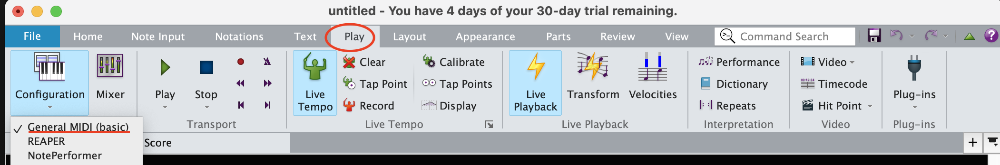

1. Make sure Sibelius is closed.
2. In REAPER create 2 tracks. The first will house your backing track. The 2nd will house your ReWire plugin.
3. Under FX, search for and activate **ReWire:Sibelius/x86_64**
4. Sibelius will automatically launch.
5. Open your score. Now when you press play in Sibelius, REAPER will begin playback (and vice versa). 

**Note:** You'll want to make sure your REAPER session (and backing track) is set to the same tempo as your Sibelius session, or composing won't make much sense. If you have tempo changes in your Sibelius session, check the "Allow client to set tempo" box in the ReWire plugin. 

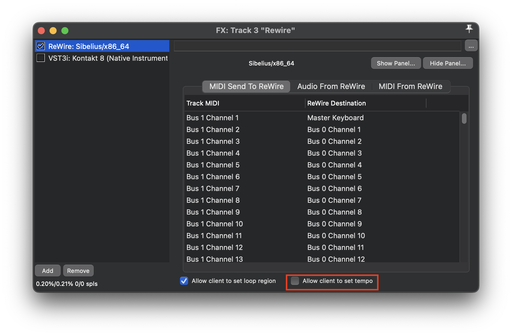

Make sure you close Sibelius first once you're done, otherwise REAPER gets stuck waiting for it to close.

## Advanced Setup

The basic setup has the flaw of you  need to listen to Sibelius' awful audio.

This setup allows you to pipe your midi data from Sibelius into REAPER, and control all your sound there. This allows for easier mixing, FX, and VST use.

**Note:** The Windows systems don't have a native virtual MIDI pipeline like Macos does, so you'll need to use a third party software for the following step.
There's a great article [here](https://stash.reaper.fm/19995/REWIRE%20Sibelius7%20Slave%20to%20Reaper%20Master.pdf) detailing the specifics using a virtual MIDI pipeline called [LoopBe](https://www.nerds.de/en/loopbe30.html).

1. Open **Audio MIDI Setup**, and then press ⌘2 to open the MIDI Studio.
2. Double click the red IAC Driver
3. Below the "Ports" box, click the + to create a port. Rename this to whatever you want (Mine is "Sibelius Bus").

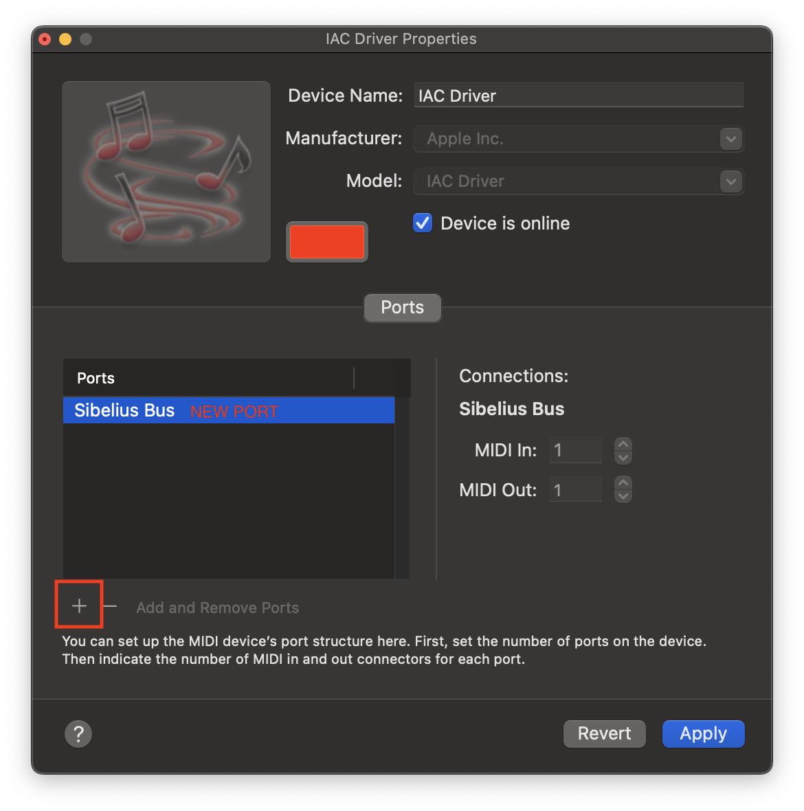

4. Click Apply

5. Inside REAPER, open preferences (⌘.) 
6. Under Audio -> MIDI Inputs, enable your newly created port - **Apple Inc. - IAC DRIVER - YOURPORTNAME** by clicking in the spaces to the right (Input, All, Control), and then click Apply.

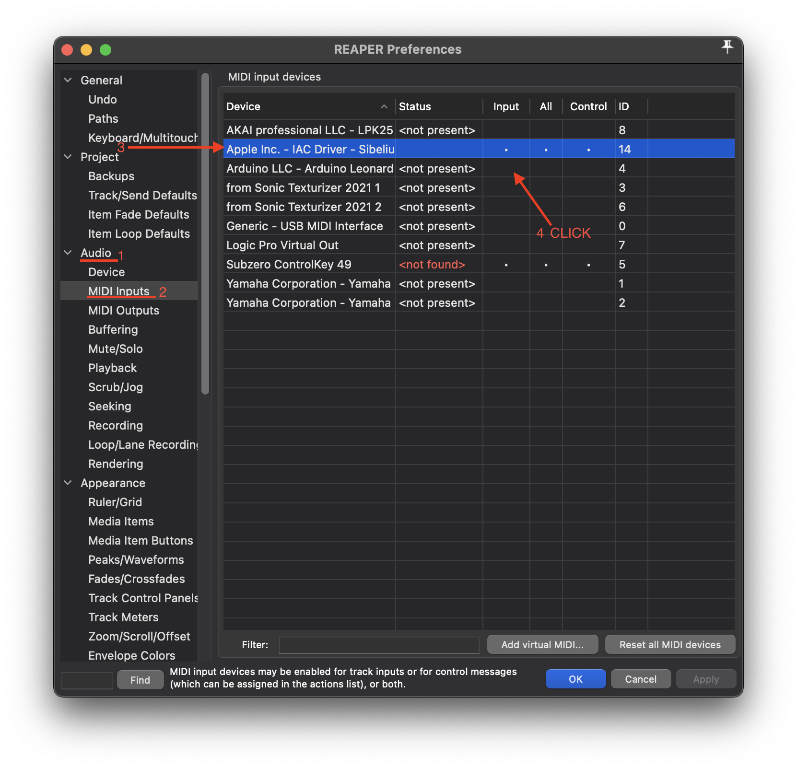

7.  Back inside the main editor window create 2 tracks - Track 1 is for ReWire (add it under FX), Track 2 is for your VSTi (In my case I'm using [Kontakt 8](https://www.native-instruments.com/en/products/komplete/samplers/kontakt-8-player/))

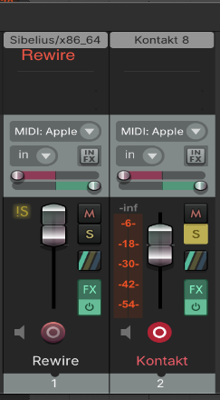

8. Record arm Track 2 by pressing the red button on the track.
9. Change your input to **Input:MIDI - Apple Inc. - IAC DRIVER - YOURPORTNAME** 

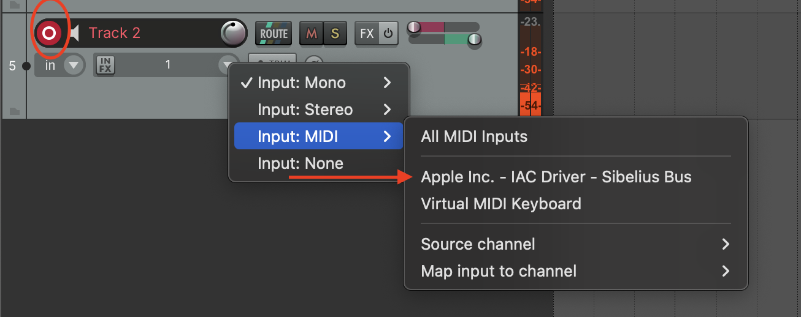

10. Inside Sibelius, open the play tab, and click the little square in the corner of the setup section

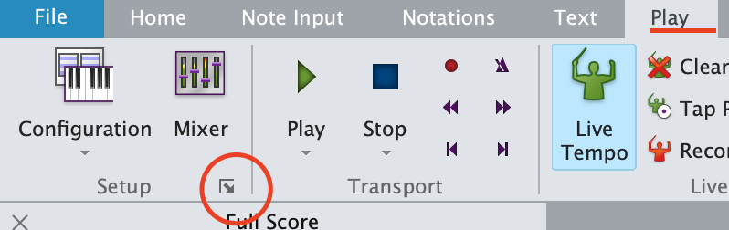

11. Click the "New..." button and name your new playback configuration.

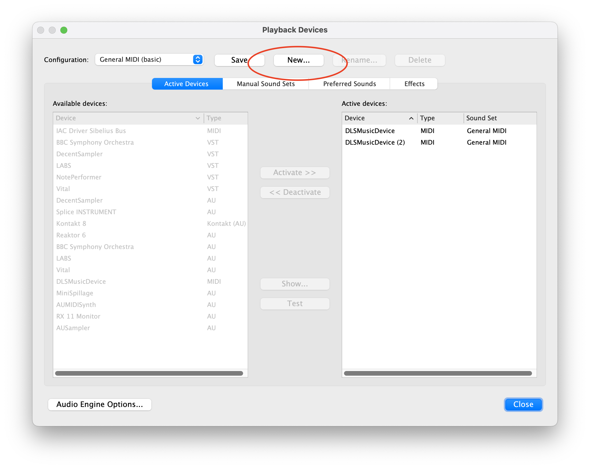

12. In the list of available devices on the left find your **IAC DRIVER - YOURPORTNAME** device, and activate it.

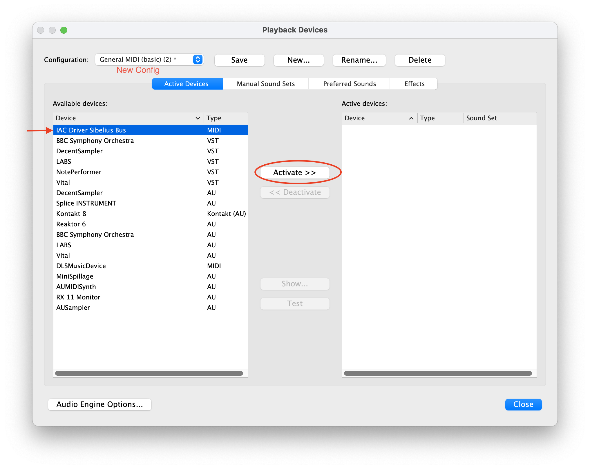
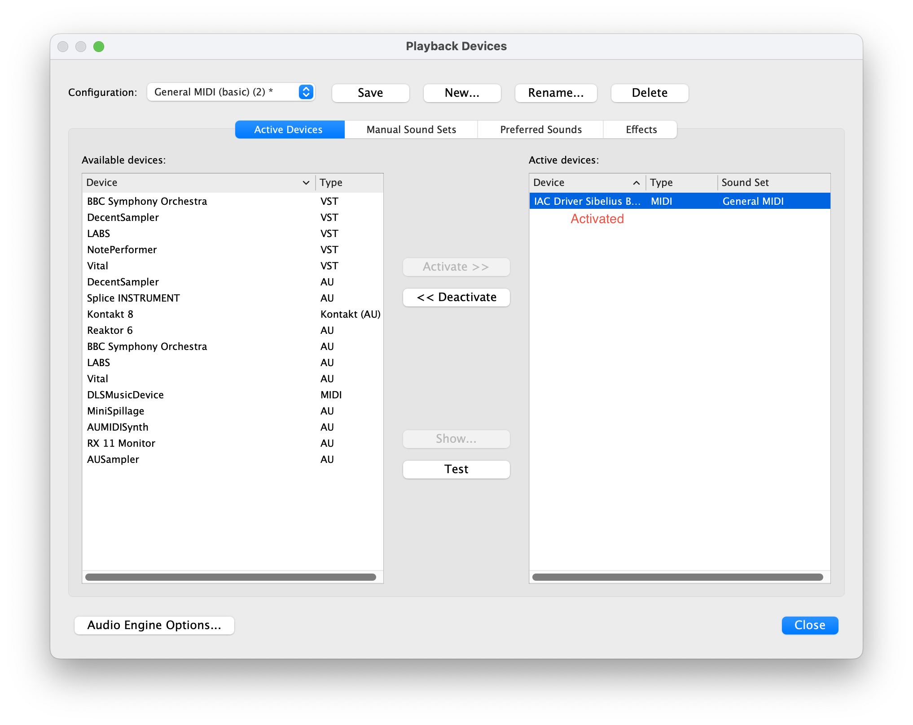

13. Under Manual Sound Sets, make sure your **IAC DRIVER - YOURPORTNAME** is selected, and the sound set is set to "(none)". If nothing appears here, restart both Sibelius and REAPER.

14. Check "Use manual sound set", and set the number of channels to the number of instruments on your score.
15. Under "Sound Settings" set each channel's  "Sound ID:" to the name of your instruments, and APPLY.

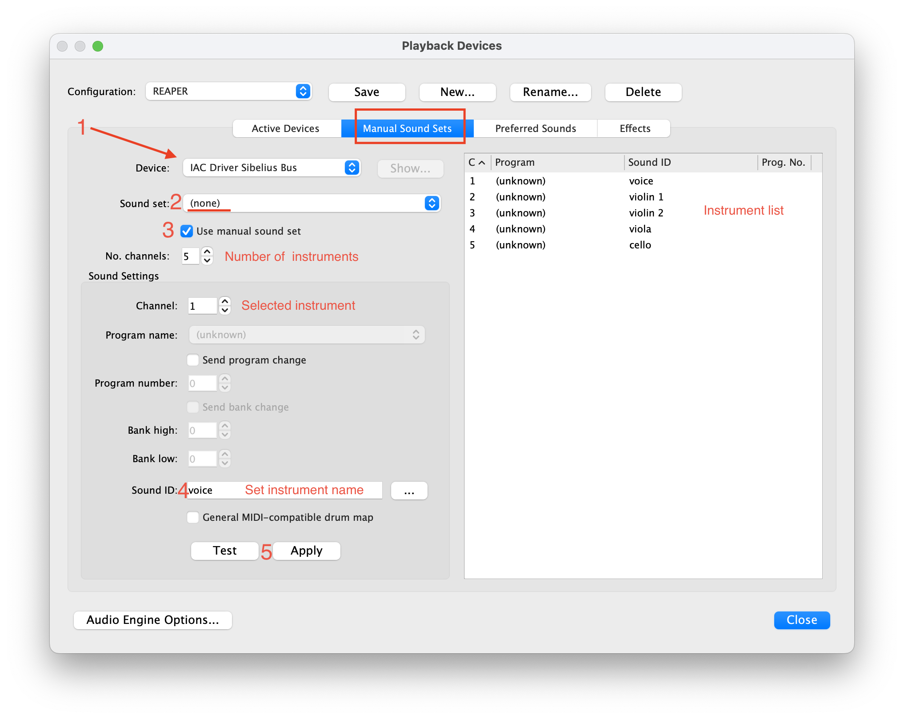

16. Inside the main Sibelius window open the mixer with **M** , and then press the top green button 2x to see the assigned sound sets.
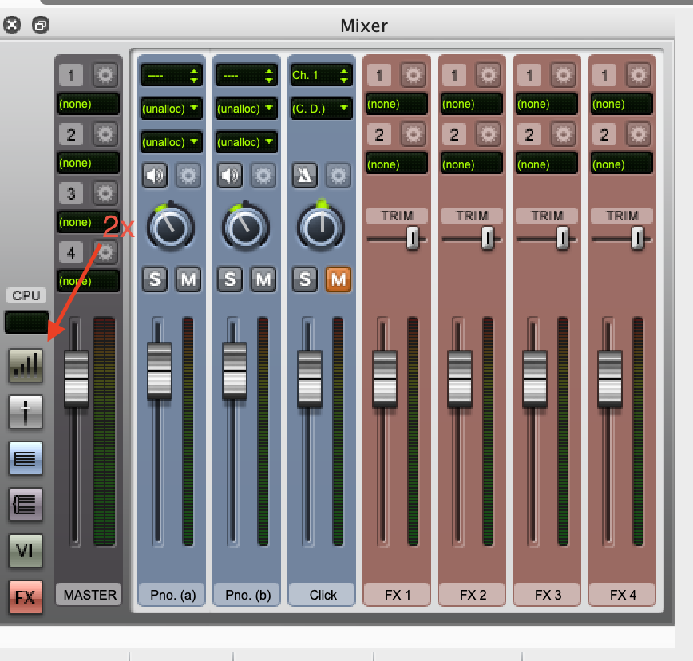

17. Assign each of your instruments to **IAC DRIVER - YOURPORTNAME** and then the appropriate channel (Click where it says "Unallocated").

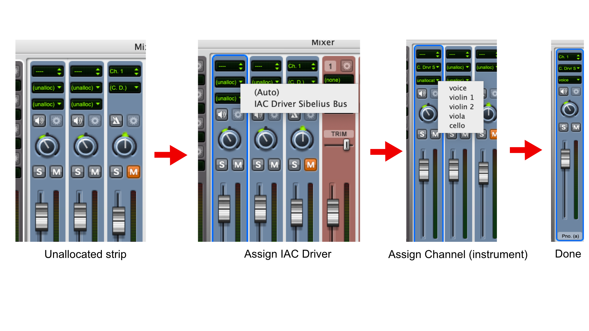

18. Back inside REAPER open Kontakt. You can load multiple instruments into one instance of Kontakt, so do so for each of the instruments in your score (You can save this as an instrument Multi under **File-Save Multi as...**)

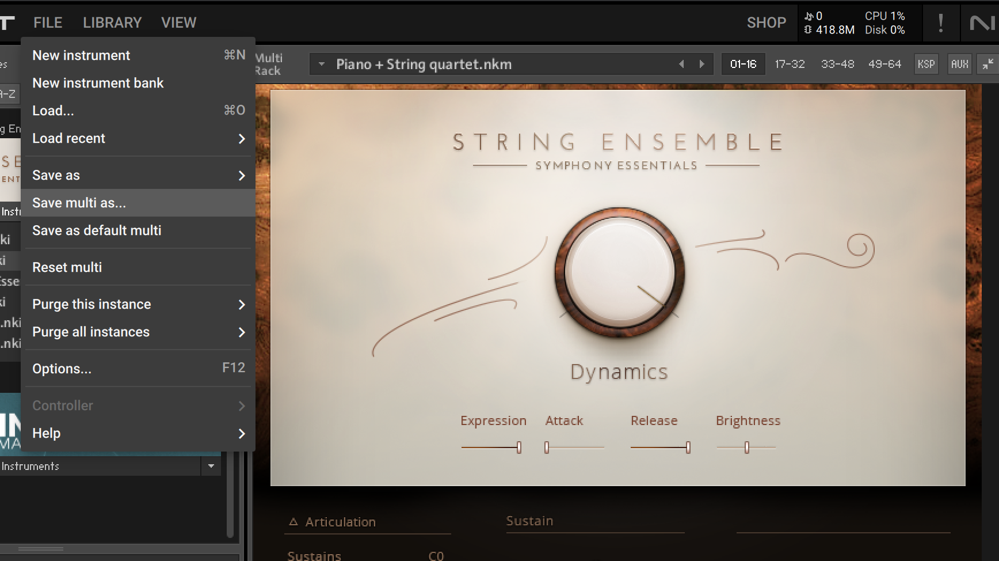

19. In the instrument header, set the channel of the instrument to Port A[From Host] and its corresponding channel number in Sibelius.

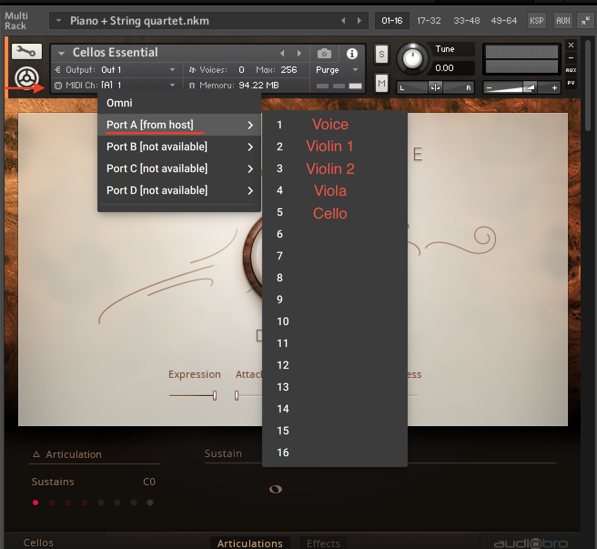

You're Sibelius instruments should now be routed to the audio of your Kontakt instruments inside REAPER. Note playback and general playback should sync automatically, and you can customize your Kontakt instruments as you see fit. If you want to have separate instances of Kontakt for each instrument that's ok (but more resource intensive), just make sure to assign your MIDI channels correctly in the instrument header. I've written this with Kontakt 8 in mind, but the above steps should work with any sampler, just look for **MIDI Input settings**.

